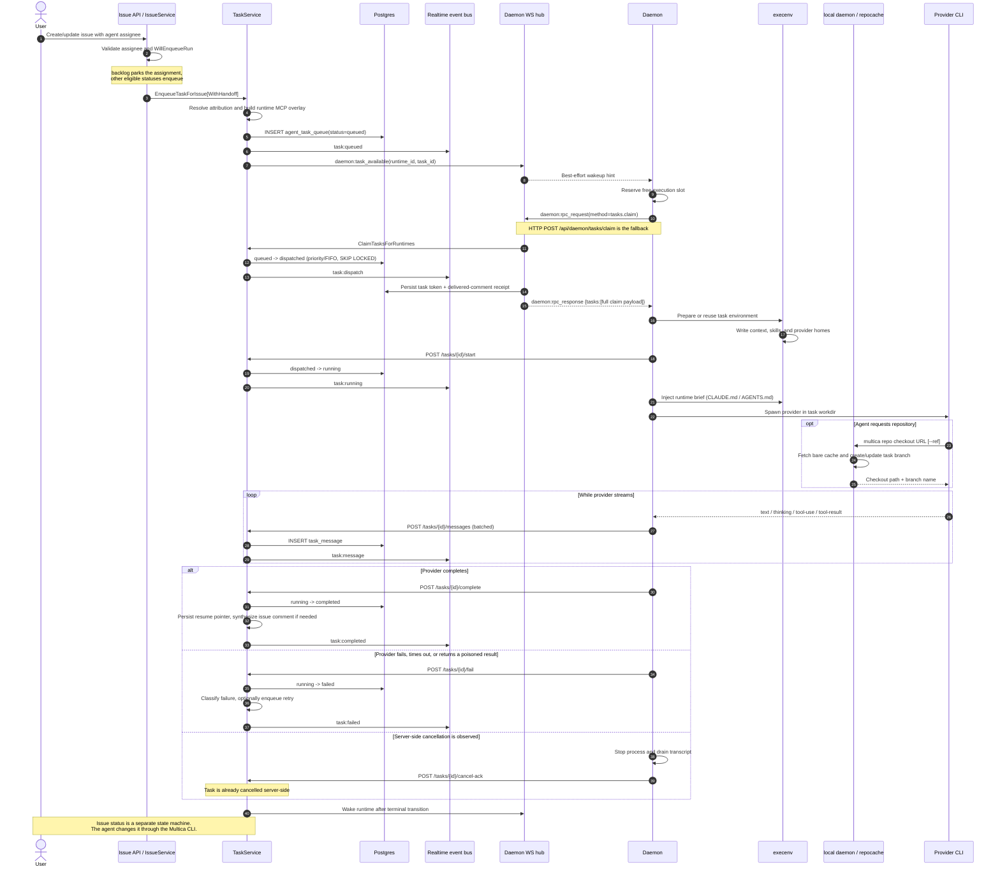
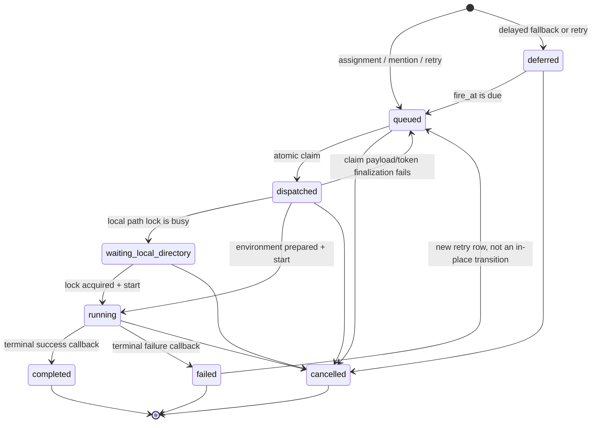
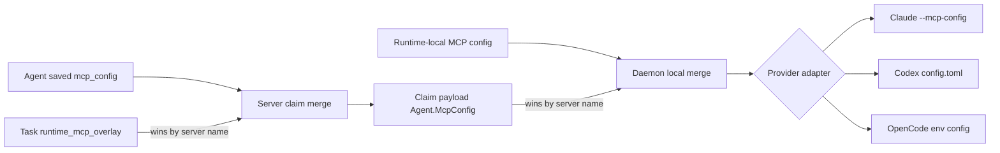

# Agent execution pipeline

This map freezes the issue-assignment execution path from the server write that
creates an `agent_task_queue` row through daemon dispatch, provider execution,
live transcript reporting, and terminal state. It describes the current
implementation, including the WebSocket/HTTP split and the per-task MCP overlay.

## One task's life



The wakeup is deliberately sent only after the row exists and after the
workspace-facing `task:queued` event. The daemon also polls, so a dropped wakeup
delays a claim but does not lose it.

## Admission and queue contract

An issue create or update starts a run only when the resulting assignee is a
ready, non-archived agent with a runtime (or a ready squad leader), the issue is
not parked in `backlog`, the write is not suppressed, and the self-loop guard
does not detect the same agent promoting the issue it is currently executing.
`WillEnqueueRun` is shared by write and preview paths.

The enqueue path:

1. Resolves the runnable agent and its runtime.
2. Resolves human attribution. Fail-closed workspaces reject a task that cannot
   be attributed.
3. Builds the per-task MCP/connected-app snapshot.
4. Inserts the `agent_task_queue` row with issue, agent, runtime, priority,
   trigger/handoff, attribution, MCP overlay, and retry/session fields.
5. Publishes `task:queued`.
6. Invalidates the empty-claim cache, then emits the daemon wakeup.

Assignment is not cancellation. Reassigning an issue or changing its issue
status does not implicitly stop already-running tasks; explicit task
cancellation and issue deletion are separate operations.

### Queue state machine



Claims are ordered by priority descending and creation time ascending. The SQL
uses `FOR UPDATE SKIP LOCKED` and prevents one agent from concurrently running
two tasks for the same issue (or chat session), while allowing different agents
to work on the same issue.

`dispatched` is a preparation lease, not proof that a subprocess exists. The
daemon reserves a local execution slot before claiming, prepares the workdir,
and calls `start` only after the workdir is present. Lost claim responses and
expired preparation leases have explicit reclaim paths.

## Daemon WebSocket protocol

The daemon connection is `GET /api/daemon/ws?runtime_ids=...`, authenticated
with the same daemon/PAT credential family as daemon HTTP. Every frame uses:

```json
{
  "type": "daemon:<kind>",
  "payload": {}
}
```

| Direction | Type | Payload and meaning |
| --- | --- | --- |
| server -> daemon | `daemon:task_available` | `{runtime_id, task_id?}`. Best-effort hint only; it wakes the batch poller and carries no executable task payload. |
| daemon -> server | `daemon:heartbeat` | `{runtime_id, supports_batch_import?}`. Updates liveness and asks for pending runtime actions. |
| server -> daemon | `daemon:heartbeat_ack` | `{runtime_id, status, server_capabilities?, runtime_gone?, pending_*?}`. Explicitly negotiates `rpc-v1`; `runtime_gone` triggers daemon self-healing. |
| daemon -> server | `daemon:rpc_request` | `{request_id, method, body?, timeout_ms?}`. The task path currently defines `method="tasks.claim"` with body `{daemon_id, runtime_ids, max_tasks}`. |
| server -> daemon | `daemon:rpc_response` | `{request_id, status, body?, error?}`. For `tasks.claim`, a success body is `{"tasks":[...]}` and is byte-shaped like the HTTP batch endpoint. |
| server -> daemon | `daemon:runtime_profiles_changed` | Workspace-scoped pull hint; not part of an individual task lifecycle. |
| server -> daemon | `daemon:workspaces_changed` | Account-scoped reconciliation hint; not part of an individual task lifecycle. |

The daemon advertises `rpc-v1` in `X-Client-Capabilities`, but uses WebSocket RPC
only after the server echoes support in a heartbeat ack. The server runs an RPC
with the requested timeout and reuses the canonical HTTP claim handler through
an in-process request, preserving authorization, payload construction, token
minting, and comment delivery receipts.

Claim transport policy is fail-safe:

- No live/negotiated socket, a full unsent write buffer, or a definite server
  error falls back to `POST /api/daemon/tasks/claim`.
- If a request may have reached the server but its response was lost, the
  daemon does not immediately issue a second claim. It waits through the claim
  budget/grace window, then performs one HTTP cycle; stale-dispatch recovery
  owns a committed-but-unreceived claim.
- Servers without the batch endpoint fall back to the legacy per-runtime
  `POST /api/daemon/runtimes/{runtimeId}/tasks/claim`.

Task lifecycle writes are not WebSocket messages. Start, preparation lease,
waiting-local-directory, progress, session pinning, usage, transcript batches,
complete/fail, status polling, and cancellation acknowledgement use authenticated
daemon HTTP endpoints. Workspace WebSocket events then expose their results to
clients.

## Claim payload and security boundary

The claim response contains the task IDs and context, the selected runtime,
fresh agent settings, skill bundles or references, project/workspace resources,
prior session/workdir hints, comment input, attribution, and a task-scoped auth
token.

The server first changes the row to `dispatched`, then builds the full payload.
It atomically persists:

- a hash of the 24-hour task token bound to task, agent, workspace, and runtime
  owner; and
- the exact comment IDs embedded in this claim.

Only then is the response written. A finalization failure requeues that exact
claim using a compare-and-swap on its dispatch timestamp. The daemon injects the
plain token as `MULTICA_TOKEN` and must never fall back to its owner-level daemon
credential for agent subprocesses.

## Runtime environment and provider sidecars

`execenv.Prepare` creates:

```text
<workspaces-root>/<workspace-id>/<short-task-id>/
├── workdir/                 # empty until the agent checks out a repo
├── output/
├── logs/
├── .multica_sidecar_manifest.json
├── codex-home/              # Codex only
└── task-home/               # Linux Codex sandbox only
```

A resumable issue task may reuse its prior managed workdir. A
`local_directory` resource instead uses the user's directory as `workdir`,
serializes access with a daemon-local path mutex, and records every injected
file/directory so normal cleanup can restore the directory without deleting
user-owned content.

Common workdir context:

- `.multica/daemon_task_context.json`: fail-closed proof that nested CLI calls
  belong to a daemon task.
- `.agent_context/issue_context.md`: structured issue/task context.
- `.multica/project/resources.json`: project and resource data when a project
  is attached.
- The runtime brief: complete workflow, identity, comment/reply, repository,
  project, and skill instructions.

| Provider | Runtime brief | Skill delivery | MCP delivery | Launch/discovery details |
| --- | --- | --- | --- | --- |
| Claude Code | `workdir/CLAUDE.md` managed marker block | `workdir/.claude/skills/<slug>/SKILL.md`; per-task settings hide disabled runtime skills | Mode-0600 temporary JSON, passed as `--mcp-config`; managed config also enables `--strict-mcp-config` | Spawned with stream JSON in `workdir`; prompt is sent over stdin. |
| Codex | `workdir/AGENTS.md` managed marker block | Per-task `$CODEX_HOME/skills`; workspace skills are combined with allowed user skills | Managed `[mcp_servers.*]` block in `$CODEX_HOME/config.toml` at mode 0600 | Uses `codex app-server --listen stdio://`; per-task `CODEX_HOME` also owns sandbox, session, memory, and multi-agent policy. Linux gets a writable task HOME. |
| OpenCode | `workdir/AGENTS.md` managed marker block | `workdir/.opencode/skills/<slug>/SKILL.md` | Canonical `mcpServers` is translated to OpenCode `mcp` and injected through `OPENCODE_CONFIG_CONTENT`; no project config file is overwritten | Uses `opencode run --dir <workdir>`, `cmd.Dir=<workdir>`, and `PWD=<workdir>` so discovery starts at the task root. |

Runtime-config injection preserves any pre-existing `CLAUDE.md`/`AGENTS.md`
bytes by appending or replacing a marked Multica block. For
`local_directory`, the block and sidecars are removed after execution. Cloud
workdirs retain them for session/workdir reuse and are later reclaimed by GC.

## MCP overlay injection

The overlay has three distinct merge stages:



1. At enqueue, `TaskService` asks the runtime-app provider to build a task
   overlay and stores it in `agent_task_queue.runtime_mcp_overlay`. The current
   Composio producer emits a canonical
   `{"mcpServers":{"composio":{...}}}` entry plus a connected-app summary. Its
   capability view is the agent owner's toolkit allowlist intersected with the
   owner's active connections; the task originator is retained for attribution,
   not used as the connected-app credential owner.
2. At claim, `server/internal/handler/mcp_overlay.go` shallow-merges the task
   overlay over `agent.mcp_config` by `mcpServers` name. Overlay entries win;
   non-`mcpServers` top-level keys survive only from the agent config. Malformed
   overlay data logs a warning and falls back to the saved agent config rather
   than dropping the agent's tools or failing the claim.
3. On the daemon host, `mergeRuntimeAndAgentMcpConfig` reads supported
   runtime-local MCP configuration without sending its secrets to the server,
   then layers the claim's config over it by server name. Provider adapters
   materialize that effective config as shown above.

The database trigger `trg_clear_runtime_mcp_overlay` clears the overlay whenever
the task enters `completed`, `failed`, or `cancelled`, so bearer-bearing session
data does not remain on terminal queue rows.

## Repository checkout and task worktrees

Claimed tasks receive repository metadata, not an eager checkout. For a
project-bound issue, project `github_repo` resources replace workspace-level
repositories when present. The daemon registers the task-scoped URLs in its
local allowlist.

When the agent runs `multica repo checkout <url> [--ref ...]`:

1. The CLI requires `MULTICA_DAEMON_PORT` and posts the current workspace,
   workdir, task, agent name, optional ref, and checkout mode to local
   `127.0.0.1:<port>/repo/checkout`.
2. The local daemon verifies that the URL belongs to current workspace/task
   context and ensures its bare cache is ready.
3. An explicit `--ref` wins. Otherwise the daemon uses the task's project repo
   default ref, then the remote default branch.
4. `repocache.CreateWorktree` fetches the bare cache and creates
   `<workdir>/<repo-name>` on
   `agent/<sanitized-agent-name>/<short-task-id>`.
5. Existing managed checkouts in reused workdirs are updated rather than
   duplicated. Agent context paths are excluded from Git, and the optional
   co-author hook follows workspace settings.

Most providers use a linked worktree backed by the daemon's shared bare cache.
Linux Codex sets `MULTICA_REPO_CHECKOUT_MODE=isolated`, producing a local clone
with task-local Git metadata because Codex's workspace-write sandbox cannot
write a linked worktree's external Git directory. Its `origin` is changed back
to the real repository before execution continues.

## Execution, messages, and terminal reporting

After environment preparation, the daemon calls `start`, then spawns the
provider with:

- task-scoped Multica auth and IDs;
- workspace, daemon port, agent identity, and concurrency slot;
- the prepared workdir and provider-specific homes/config;
- saved custom environment/arguments after protected-key filtering; and
- model, thinking level, service tier, MCP config, and resume session.

Provider streams are normalized into status, thinking, text, tool-use, and
tool-result messages. The daemon:

- assigns monotonically increasing sequence numbers;
- coalesces text/thinking and flushes batches about every 500 ms;
- posts batches with a five-second request budget;
- pins the first observed session ID/workdir immediately for crash recovery;
- drains the transcript before handing off the terminal result; and
- reports usage independently, including on failure/cancellation.

The server redacts message content, tool input, and tool output before
persisting `task_message` rows and publishing `task:message`. Clients can catch
up with `GET /api/daemon/tasks/{taskId}/messages?since=<seq>`.

On completion, the server atomically changes the task to `completed`, stores
the result and resume pointer, and handles chat output when applicable. For an
issue task, it guarantees visible output: if the agent did not already comment,
the server may synthesize an issue comment from the final output, threaded
under the trigger comment when relevant.

On failure, the server classifies the reason, preserves safe resume pointers,
may create an immediate or deferred retry row, and emits a user-visible failure
comment when no retry owns the next outcome. Terminal callbacks are retried by
the daemon; a transiently exhausted completion callback deliberately leaves the
task `running` rather than converting a successful agent result into a false
failure.

## Task status versus issue status

`agent_task_queue.status` represents execution infrastructure. `issue.status`
represents product workflow. They are intentionally not coupled:

- `StartTask`, `CompleteTask`, and the normal daemon `FailTask` path state
  explicitly that they do not change issue status.
- The runtime brief instructs the agent to use `multica issue status` to move
  its assigned issue through `in_progress`, `in_review`, `blocked`, or other
  workflow states.
- Infrastructure failure sweep/recovery paths call `HandleFailedTasks`; when
  an issue is still `in_progress`, has no active task, and received no retry,
  that recovery pipeline may reset it to `todo` and broadcast `issue:updated`.
- A retry is a new queue row. It does not rewind the terminal row it follows.

This separation is why a task can be `completed` while its issue is
`in_review`, or a task can be `failed` while the issue retains an agent-chosen
`blocked` state.

## Workspace-facing task events

| Event | Observable transition |
| --- | --- |
| `task:queued` | New immediately claimable row, or a due deferred row promoted to queued |
| `task:dispatch` | `queued -> dispatched` during claim |
| `task:waiting_local_directory` | Claimed task parked on a daemon-local path mutex |
| `task:running` | Preparation finished and provider launch is beginning |
| `task:progress` | Coarse daemon progress hint |
| `task:message` | Persisted live transcript row |
| `task:completed` | `running -> completed` |
| `task:failed` | `running -> failed` or a recovery/sweeper failure |
| `task:cancelled` | Non-terminal task moved to cancelled |

## Source index

| Area | Primary implementation |
| --- | --- |
| Issue create/assignment admission | `server/internal/service/issue.go` (`maybeEnqueueOnAssign`); `server/internal/handler/issue_trigger.go`; `server/internal/service/issue_trigger.go` |
| Queue insert, claim, state transitions, retries | `server/internal/service/task.go`; `server/pkg/db/queries/agent.sql` |
| Queue schema and overlay lifecycle | `server/migrations/001_init.up.sql`; `server/migrations/109_agent_task_waiting_local_directory.up.sql`; `server/migrations/128_comment_routing_escalation.up.sql`; `server/migrations/128_agent_task_queue_runtime_mcp_overlay.up.sql` |
| Daemon WS envelopes and event names | `server/pkg/protocol/messages.go`; `server/pkg/protocol/events.go` |
| Server WS hub and wakeup relay | `server/internal/daemonws/hub.go`; `server/internal/daemonws/notifier.go` |
| Daemon WS connection and heartbeat | `server/internal/daemon/wakeup.go` |
| WS-first claim and HTTP fallback | `server/internal/daemon/wsrpc.go`; `server/internal/handler/daemon_rpc.go`; `server/internal/handler/daemon.go` |
| Daemon poll/dispatch/run loop | `server/internal/daemon/daemon.go`; `server/internal/daemon/client.go`; `server/internal/daemon/types.go` |
| Common context and sidecars | `server/internal/daemon/execenv/execenv.go`; `context.go`; `runtime_config.go`; `sidecar_manifest.go` |
| Provider subprocess adapters | `server/pkg/agent/claude.go`; `codex.go`; `opencode.go`; `opencode_mcp.go` |
| Server-side MCP overlay | `server/internal/handler/mcp_overlay.go`; `server/internal/integrations/composio/dispatch.go` |
| Runtime-local MCP merge | `server/internal/daemon/runtime_mcp.go` |
| Repository checkout | `server/cmd/multica/cmd_repo.go`; `server/internal/daemon/health.go`; `server/internal/daemon/repocache/cache.go` |
| Transcript persistence/reporting | `server/internal/daemon/daemon.go` (`executeAndDrain`); `server/internal/handler/daemon.go` (`ReportTaskMessages`); `server/pkg/db/queries/task_message.sql` |
